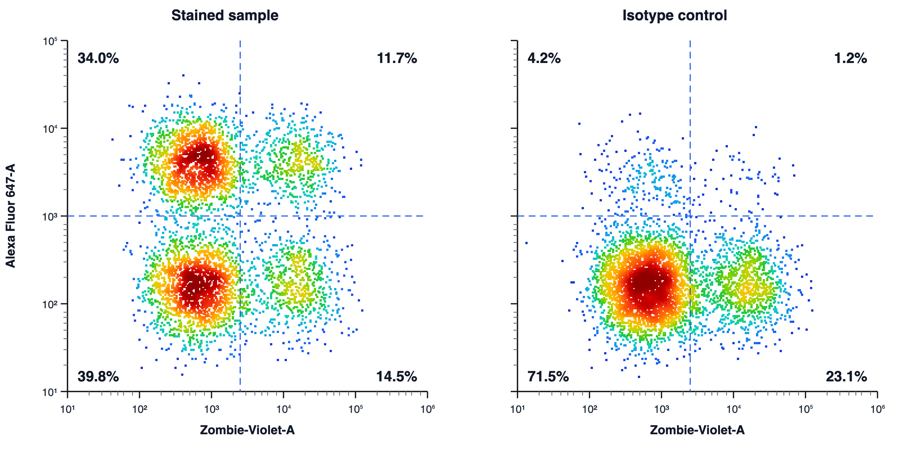
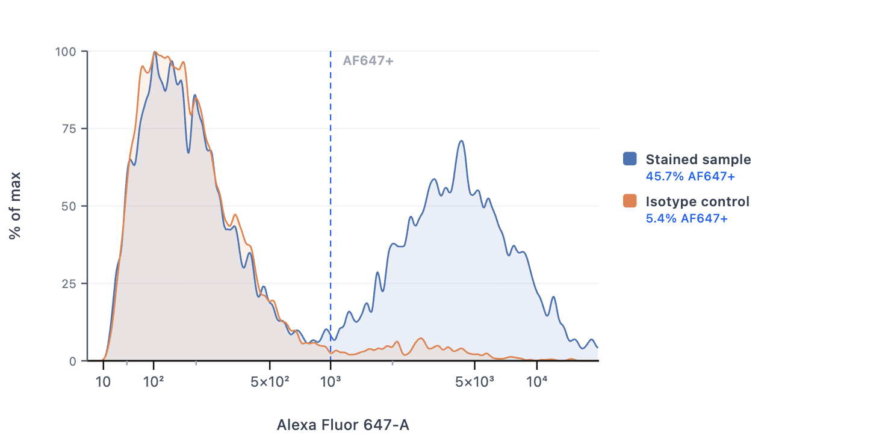

# Flume

A fast, private, **browser-based flow cytometry viewer**. Drop in CSV/TSV channel
exports (or raw `.fcs` files) and get publication-quality figures plus standard
cytometry statistics — with **no accounts, no server, and no data leaving your
machine**.

**Live app:** https://mattocanas.github.io/flume/

---

## Screenshots

Quadrant density plots with draggable gates and live per-quadrant percentages:



Overlay histograms comparing samples on a shared axis, with % positive per sample:



*(Figures generated from the synthetic files in [`examples/`](./examples) — no real data.)*

---

## Features

- **Import** — CSV/TSV channel-value exports (e.g. FlowJo → Export → Channel
  Values), or raw `.fcs` files with in-browser polygon gating on the Analysis tab.
- **Plot types**
  - Single-sample **histograms** (small multiples)
  - **Overlay** histograms (superimposed)
  - **Ridge** plots with adjustable row overlap and Side / Compact / Legend labels
  - 2-D **dot / density** plots with a smoothed, density-sorted rainbow colormap
- **Gating** — draggable quadrant, vertical, and horizontal gates with live
  per-region percentages.
- **Statistics** — geometric mean fluorescence intensity (gMFI, computed over
  events > 0) for whole and gated populations, arithmetic MFI for gated events,
  plus log₂ fold-change across a gate or against a reference sample.
- **Figure controls** — dot size, independent tick / axis-label font sizes,
  panel column layout, plot reorder, per-plot show/hide, custom palettes and
  per-sample colors.
- **Export** — individual plots or a composited multi-sample panel as PNG;
  SVG export for histogram and ridge views.

## Try it with example data

The [`examples/`](./examples) folder has two small synthetic CSVs. Drag both onto
the upload box to explore histograms, overlays, ridge plots, quadrant gating, and
gMFI / log₂ fold-change — no real data needed.

## Method notes & scope

Flume is a **viewer and figure-maker**, not a replacement for a full analysis
package. A few things worth knowing so the numbers mean what you expect:

- **Compensation / spillover is not applied.** Raw `.fcs` files are plotted
  **uncompensated**. For the CSV workflow this is a non-issue — FlowJo (etc.)
  channel-value exports are already compensated upstream. But for multicolor
  panels on the **Analysis (raw `.fcs`) tab**, compensate in your acquisition or
  analysis software first and export channel values, or spillover spread will
  appear as real signal.
- **gMFI is a geometric mean over positive events.** Events with value ≤ 0
  (which the biexponential view shows near the origin) are excluded from the
  geometric mean, as they must be. For dim/negative populations this biases gMFI
  upward relative to the arithmetic mean; the `MFI` column is the arithmetic mean
  of gated events if you need it.
- **The "Biexp" axis is an asinh transform** (cofactor 150), a biexponential-style
  scale — not FlowJo's Logicle. It faithfully shows the near-zero/negative
  population, but gate pixel-positions won't exactly match FlowJo.
- **FCS support:** FCS 3.0 / 3.1, list-mode, single dataset. Datatypes `F`
  (32-bit float), `D` (64-bit float), and `I` (8/16/32-bit integer). Log-amplified
  data (`$PnE`) and gain (`$PnG`) are not back-transformed — intended for modern
  linear-digital instruments. Unsupported files are rejected with a clear message
  rather than mis-parsed. Validated against Attune NxT and MACSQuant exports.

## Privacy

Flume runs entirely in your browser. CSV/FCS parsing, analysis, and rendering
all happen locally on the client; nothing is uploaded. This makes it safe for
unpublished or sensitive data.

## Run locally

Requires [Node.js](https://nodejs.org/) 18 or newer.

```bash
npm install
npm run dev      # start the dev server (http://localhost:5173)
npm run build    # production build into dist/
npm run preview  # preview the production build locally
```

## Deploy

Flume is a static single-page app and deploys to any static host. This repo
includes a GitHub Pages workflow (`.github/workflows/deploy.yml`) that builds and
publishes on every push to `main`. To enable it: **Settings → Pages → Build and
deployment → Source: GitHub Actions.**

The Vite `base` is set to `/flume/` to match the Pages repo subpath. For a custom
domain or root-level deploy, set `BASE_PATH=/` when building.

## Tech

React 18 + Vite. All plotting is hand-written on HTML5 Canvas and SVG — no
third-party charting or statistics libraries.

## Author

Created by Matthew Ocanas.

## License

[BSD 3-Clause](./LICENSE) — Copyright (c) 2026, Board of Regents, The University of Texas System.
